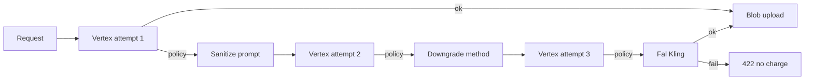

# Fal-hosted Kling policy fallback

When Vertex Veo or Vertex/Gemini image generation is blocked by content policy, SceneFlow retries on Vertex (up to `VEO_POLICY_MAX_ATTEMPTS`, default 3), then may fall back to **Kling models on Fal.ai** (`https://fal.run/fal-ai/...`) using the platform **`FAL_KEY`** (pay-as-you-go).

## Flow

## Configuration

| Variable | Purpose |
|----------|---------|
| `VEO_POLICY_MAX_ATTEMPTS` | Vertex tries before Fal (default `3`) |
| `FAL_KLING_POLICY_FALLBACK_ENABLED` | Set `false` to disable (`KLING_POLICY_FALLBACK_ENABLED` alias) |
| `FAL_KEY` | Fal.ai API key ([docs](https://fal.ai/docs/documentation/setting-up/authentication)) |
| `FAL_KLING_T2V_MODEL` | Default `fal-ai/kling-video/v3/standard/text-to-video` |
| `FAL_KLING_I2V_MODEL` | Default `fal-ai/kling-video/v3/pro/image-to-video` |
| `FAL_KLING_IMAGE_MODEL` | Default `fal-ai/kling-image/v3/text-to-image` |

Deprecated (no longer used): `KLING_API_KEY`, `KLING_ACCESS_KEY`, `KLING_SECRET_KEY`, `KLING_VIDEO_MODEL`, `KLING_IMAGE_MODEL`.

## Credits

- Vertex failures before a successful blob: **no** segment video charge.
- Fal success: `VIDEO_CREDITS.FAL_KLING_VIDEO_5S` / `FAL_KLING_VIDEO_10S` or `IMAGE_CREDITS.FAL_KLING_IMAGE`.

## Response metadata

| Field | Values |
|-------|--------|
| `generationProvider` | `'vertex'` \| `'fal'` |
| `fallbackModelFamily` | `'kling'` when Fal completed the clip |
| `wasPolicyFallback` | `true` when Fal was used after Vertex policy exhaustion |

## Continuous beats / EXT

- **Vertex EXT** requires a prior segment `veoVideoRef` (Vertex-only).
- If the previous part used **`generationProvider: 'fal'`**, EXT is skipped; use I2V with the prior clip’s last frame (`priorSegmentSupportsVertexExt` in `veoChainQueue.ts`).

## Modules

- `src/lib/generation/contentPolicy.ts` — `isFalKlingFallbackEnabled()`
- `src/lib/generation/veoWithKlingFallback.ts`
- `src/lib/generation/vertexImageWithKlingFallback.ts`
- `src/lib/fal/klingPolicyClient.ts`

## Content validation

Fal/Kling output is not auto-moderated after upload. Users may run paid Hive validation on segment video via `POST /api/moderation/validate` (`stage: fal_video`, `source: segment_asset`). See [HIVE_MODERATION.md](./HIVE_MODERATION.md).
