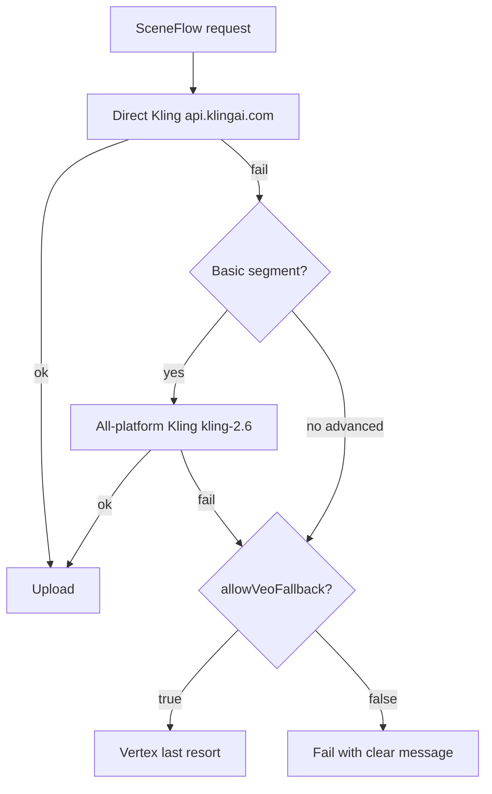
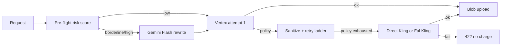

# Kling policy fallback + primary video provider

**As of the Kling-primary rollout**, direct Kling (`kling-v3-omni` internal id, mapped to official `kling-v2-6` at the API) is the **default production video engine** for segment generation. When direct Kling fails on a **basic** segment (plain T2V/I2V/REF, no multi-shot/elements/voices/presets/extension), SceneFlow automatically tries **all-platform Kling** via the video aggregator (`kling-2.6` default). Vertex Veo is an **opt-in** last resort when `allowVeoFallback` is explicitly enabled.

When Vertex Veo or Gemini Omni video generation is used explicitly (or as opt-in fallback), SceneFlow uses a **layered defense** before falling back to Kling on the legacy Vertex-primary path:


1. **Pre-flight risk score** — fast local regex + semantic triggers (`preflightPromptGuard.ts`)
2. **Choreography rewrite** — Gemini Flash neutralizes borderline/high-risk prompts (additive affirmation, no negations)
3. **Vertex policy ladder** — sanitize → reference trim → method downgrade (`veoWithKlingFallback.ts`)
4. **Kling fallback (last resort)** — direct Kling API preferred, else Fal-hosted Kling

## SceneFlow failover chain (direct Kling primary)



**All-platform aggregator limits** (why advanced jobs skip backup): no lip-sync, no video-extend/long-take, no multi-shot, no elements/voices/presets, no start+end (FTV) frames, max ~8s duration. Long-take pipeline stays direct-only.

| Env | Default | Purpose |
|-----|---------|---------|
| `KLING_AGGREGATOR_FALLBACK_ENABLED` | `true` | Auto all-platform Kling backup for basic segments |
| `VIDEO_AGGREGATOR_KLING_FALLBACK_MODEL` | `kling-2.6` | Aggregator model id for backup |
| `KLING_VEO_FALLBACK_ENABLED` | `true` | Server-side Veo fallback when opt-in |
| `allowVeoFallback` (request) | `false` | User must opt in for Vertex after Kling paths fail |

## Flow (Vertex-primary / policy ladder)



## Pre-flight guard

| Variable | Purpose |
|----------|---------|
| `PREFLIGHT_REWRITE_ENABLED` | Set `false` to disable Flash rewrite (default: on) |
| `PREFLIGHT_IMAGE_CHECK_ENABLED` | Set `true` to run optional vision risk check on start frame (default: off) |

Module: `src/lib/generation/preflightPromptGuard.ts`

## Kling provider precedence

| Priority | Provider | Env |
|----------|----------|-----|
| 1 | **Direct Kling** (klingai.com) | `KLING_API_KEY` **or** `KLING_ACCESS_KEY` + `KLING_SECRET_KEY` |
| 2 | Fal-hosted Kling | `FAL_KEY` |

Set `KLING_DIRECT_FALLBACK_ENABLED=false` or `KLING_POLICY_FALLBACK_ENABLED=false` to disable direct Kling.

### Direct Kling auth

**Gateway mode** (single token):

```bash
KLING_API_KEY="api-key-kling-..."
KLING_API_BASE_URL="https://api.klingai.com/v1"  # optional override
```

**Official JWT mode** (AccessKey + SecretKey from klingai.com developer console):

```bash
KLING_ACCESS_KEY="ak_..."
KLING_SECRET_KEY="sk_..."
```

**Security:** Store keys in Vercel env vars only — never in git or `NEXT_PUBLIC_*`. Rotate any key that was exposed in chat or logs.

### Direct Kling options

| Variable | Default |
|----------|---------|
| `KLING_MODEL_NAME` | `kling-v2-6` (official API name; internal default `kling-v3-omni` maps to this) |
| `KLING_VIDEO_MODE` | `std` (`pro` for higher quality) |
| `KLING_SOUND_ENABLED` | `on` (native audio for dialogue) |

## Fal-hosted Kling (secondary)

| Variable | Purpose |
|----------|---------|
| `FAL_KEY` | Fal.ai API key |
| `FAL_KLING_T2V_MODEL` | Default `fal-ai/kling-video/v3/standard/text-to-video` |
| `FAL_KLING_I2V_MODEL` | Default `fal-ai/kling-video/v3/pro/image-to-video` |
| `FAL_KLING_POLICY_FALLBACK_ENABLED` | Set `false` to disable |

## Vertex retry ladder

| Variable | Purpose |
|----------|---------|
| `VEO_POLICY_MAX_ATTEMPTS` | Vertex tries before Kling (default `3`) |
| `VEO_POLICY_FAST_FALLBACK` | Set `true` to skip remaining Vertex attempts after first policy block |

## Credits

- Vertex failures before a successful blob: **no** segment video charge.
- Kling fallback success (direct or Fal): `KLING_VIDEO_5S` / `KLING_VIDEO_10S` credits.

## Response metadata

| Field | Values |
|-------|--------|
| `generationProvider` | `'vertex'` \| `'fal'` \| `'kling'` |
| `fallbackModelFamily` | `'kling'` when fallback completed the clip |
| `wasPolicyFallback` | `true` when Kling was used after Vertex policy exhaustion |
| `usedBackupEngine` | `true` when `wasPolicyFallback` (subtle UI note) |

## Backup engine opt-in (DirectorDialog)

Backup engine (Kling) fallback is **off by default**. Users enable **"Allow backup engine if blocked"** in DirectorDialog → Advanced — API Prompt before generating.

| Request field | Default | Behavior |
|---------------|---------|----------|
| `allowPolicyFallback` | `false` | When `true`, Kling ladder runs after Vertex policy exhaustion |
| `apiPromptOverride` | — | When set, skips server prompt assembly and pre-flight rewrite |

Preview the assembled prompt: `POST /api/segments/[segmentId]/preview-api-prompt`

## Continuous beats / EXT

- **Vertex EXT** requires a prior segment `veoVideoRef` (Vertex-only).
- If the previous part used **`generationProvider: 'fal'` or `'kling'`**, EXT is skipped; use I2V with the prior clip's last frame (`priorSegmentSupportsVertexExt` in `veoChainQueue.ts`).

## Long-form dialogue (2-tier pipeline)

When beat dialogue exceeds **15s**, SceneFlow auto-routes to the **Kling long-take pipeline** instead of a single `generate-asset` call.

### Architecture

1. **Tier 1 — Native extend chain:** Kling base I2V (`face_consistency` when refs present, `sound: off`) → chained `video-extend` (+5s each, model locked, **180s** hard cap) → Cloud Run FFmpeg **`stitch`** mode (silent master).
2. **Tier 2 — Lip-sync overdub:** Async Kling lip-sync (`audio2video`, full dialogue MP3, up to **60s**) on the stitched master → moderate → GCS upload.

Orchestrated via **Inngest** `processKlingLongTake` with `waitForEvent` on Kling webhooks (`kling/task.completed`, 30m timeout per step) and stitch callbacks (`render/stitch.completed`).

### Enqueue

```http
POST /api/scenes/{sceneId}/beats/{beatId}/generate-longtake
```

Returns **202** + `jobId` (GenerationJob `kling_long_take`). Client polls `/api/jobs` or receives notification on completion.

### Required env

| Variable | Purpose |
|----------|---------|
| `KLING_ASYNC=true` | Async webhook mode |
| `KLING_WEBHOOK_SECRET` | Webhook signature verification |
| `KLING_WEBHOOK_BASE_URL` | Public app URL for callbacks |
| `GCS_RENDER_BUCKET` + Cloud Run job | FFmpeg stitch renderer |
| `GCP_PROJECT_ID`, `CLOUD_RUN_JOB_NAME` | Trigger stitch jobs |

Rebuild the FFmpeg renderer image after deploying the `stitch` branch in `docker/ffmpeg-renderer/render.py`.

### UI guidance

- Dialogue **>30s:** Director Dialog recommends a **camera-angle cut** or **multi-shot** instead of one continuous extend chain.
- Dialogue **>60s:** drift-risk warning; `face_consistency` defaults on when character references exist.

### Modules

- `src/lib/kling/longTakePlanner.ts` — duration math, 180s cap, warnings
- `src/lib/kling/longTakeOrchestrator.ts` — submit base/extend/stitch/lipsync/finalize
- `src/lib/kling/buildStitchJobSpec.ts` — clip-list stitch job spec
- `src/inngest/functions.ts` — `processKlingLongTake`
- `src/app/api/scenes/.../generate-longtake/route.ts` — enqueue endpoint

## Modules

- `src/lib/generation/preflightPromptGuard.ts` — risk score + Flash rewrite
- `src/lib/generation/contentPolicy.ts` — policy detection + provider selection
- `src/lib/generation/veoWithKlingFallback.ts` — Vertex ladder + Kling dispatch
- `src/lib/kling/klingDirectClient.ts` — direct Kling API
- `src/lib/kling/config.ts` — direct Kling env
- `src/lib/fal/klingPolicyClient.ts` — Fal-hosted Kling

## Content validation

Kling fallback output is **automatically moderated** via `KlingSafetyGuard` (Hive visual-moderation) before blob upload when Hive credentials are configured. Applies to both `'fal'` and `'kling'` providers.

| Variable | Purpose |
|----------|---------|
| `KLING_HIVE_GUARD_ENABLED` | Set `false` to disable mandatory Hive audit on Kling output |

See [HIVE_MODERATION.md](./HIVE_MODERATION.md).
