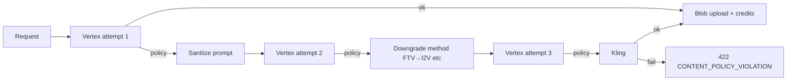

# Kling policy fallback

When Vertex Veo or Vertex/Gemini image generation is blocked by content policy, SceneFlow retries on Vertex, then may fall back to the official **Kling API** (`https://api.klingai.com/v1`) using the platform key.

## Flow

## Configuration

| Variable | Purpose |
|----------|---------|
| `VEO_POLICY_MAX_ATTEMPTS` | Vertex tries before Kling (default `3`) |
| `KLING_POLICY_FALLBACK_ENABLED` | Set `false` to disable Kling |
| `KLING_API_KEY` | Static bearer, or use JWT pair below |
| `KLING_ACCESS_KEY` / `KLING_SECRET_KEY` | Official JWT auth |
| `KLING_VIDEO_MODEL` | e.g. `kling-v2-master` |
| `KLING_IMAGE_MODEL` | e.g. `kling-v2` |

## Credits

- Vertex failures before a successful blob: **no** segment video charge.
- Kling success: `VIDEO_CREDITS.KLING_VIDEO_5S` / `KLING_VIDEO_10S` or `IMAGE_CREDITS.KLING_IMAGE` (see `creditCosts.ts`).

## Continuous beats / EXT

- **Vertex EXT** requires a prior segment `veoVideoRef` (Vertex-only).
- If the previous part used **Kling** fallback, EXT is skipped; use I2V with the prior clip’s last frame (`priorSegmentSupportsVertexExt` in `veoChainQueue.ts`).

## API modules

- `src/lib/generation/contentPolicy.ts`
- `src/lib/generation/veoWithKlingFallback.ts`
- `src/lib/generation/vertexImageWithKlingFallback.ts`
- `src/lib/kling/client.ts`

## Response metadata

Video routes include `generationProvider: 'vertex' | 'kling'` and `wasPolicyFallback` when Kling completed the clip.
