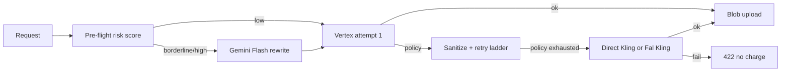

# Kling policy fallback + pre-flight prompt guard

When Vertex Veo or Gemini Omni video generation is blocked by content policy, SceneFlow uses a **layered defense** before falling back to Kling:

1. **Pre-flight risk score** — fast local regex + semantic triggers (`preflightPromptGuard.ts`)
2. **Choreography rewrite** — Gemini Flash neutralizes borderline/high-risk prompts (additive affirmation, no negations)
3. **Vertex policy ladder** — sanitize → reference trim → method downgrade (`veoWithKlingFallback.ts`)
4. **Kling fallback (last resort)** — direct Kling API preferred, else Fal-hosted Kling

## Flow



## Pre-flight guard

| Variable | Purpose |
|----------|---------|
| `PREFLIGHT_REWRITE_ENABLED` | Set `false` to disable Flash rewrite (default: on) |
| `PREFLIGHT_IMAGE_CHECK_ENABLED` | Set `true` to run optional vision risk check on start frame (default: off) |

Module: `src/lib/generation/preflightPromptGuard.ts`

## Kling provider precedence

| Priority | Provider | Env |
|----------|----------|-----|
| 1 | **Direct Kling** (klingai.com) | `KLING_API_KEY` **or** `KLING_ACCESS_KEY` + `KLING_SECRET_KEY` |
| 2 | Fal-hosted Kling | `FAL_KEY` |

Set `KLING_DIRECT_FALLBACK_ENABLED=false` or `KLING_POLICY_FALLBACK_ENABLED=false` to disable direct Kling.

### Direct Kling auth

**Gateway mode** (single token):

```bash
KLING_API_KEY="api-key-kling-..."
KLING_API_BASE_URL="https://api.klingai.com/v1"  # optional override
```

**Official JWT mode** (AccessKey + SecretKey from klingai.com developer console):

```bash
KLING_ACCESS_KEY="ak_..."
KLING_SECRET_KEY="sk_..."
```

**Security:** Store keys in Vercel env vars only — never in git or `NEXT_PUBLIC_*`. Rotate any key that was exposed in chat or logs.

### Direct Kling options

| Variable | Default |
|----------|---------|
| `KLING_MODEL_NAME` | `kling-v2-6` |
| `KLING_VIDEO_MODE` | `std` (`pro` for higher quality) |
| `KLING_SOUND_ENABLED` | `on` (native audio for dialogue) |

## Fal-hosted Kling (secondary)

| Variable | Purpose |
|----------|---------|
| `FAL_KEY` | Fal.ai API key |
| `FAL_KLING_T2V_MODEL` | Default `fal-ai/kling-video/v3/standard/text-to-video` |
| `FAL_KLING_I2V_MODEL` | Default `fal-ai/kling-video/v3/pro/image-to-video` |
| `FAL_KLING_POLICY_FALLBACK_ENABLED` | Set `false` to disable |

## Vertex retry ladder

| Variable | Purpose |
|----------|---------|
| `VEO_POLICY_MAX_ATTEMPTS` | Vertex tries before Kling (default `3`) |
| `VEO_POLICY_FAST_FALLBACK` | Set `true` to skip remaining Vertex attempts after first policy block |

## Credits

- Vertex failures before a successful blob: **no** segment video charge.
- Kling fallback success (direct or Fal): `KLING_VIDEO_5S` / `KLING_VIDEO_10S` credits.

## Response metadata

| Field | Values |
|-------|--------|
| `generationProvider` | `'vertex'` \| `'fal'` \| `'kling'` |
| `fallbackModelFamily` | `'kling'` when fallback completed the clip |
| `wasPolicyFallback` | `true` when Kling was used after Vertex policy exhaustion |
| `usedBackupEngine` | `true` when `wasPolicyFallback` (subtle UI note) |

## Continuous beats / EXT

- **Vertex EXT** requires a prior segment `veoVideoRef` (Vertex-only).
- If the previous part used **`generationProvider: 'fal'` or `'kling'`**, EXT is skipped; use I2V with the prior clip's last frame (`priorSegmentSupportsVertexExt` in `veoChainQueue.ts`).

## Modules

- `src/lib/generation/preflightPromptGuard.ts` — risk score + Flash rewrite
- `src/lib/generation/contentPolicy.ts` — policy detection + provider selection
- `src/lib/generation/veoWithKlingFallback.ts` — Vertex ladder + Kling dispatch
- `src/lib/kling/klingDirectClient.ts` — direct Kling API
- `src/lib/kling/config.ts` — direct Kling env
- `src/lib/fal/klingPolicyClient.ts` — Fal-hosted Kling

## Content validation

Kling fallback output is **automatically moderated** via `KlingSafetyGuard` (Hive visual-moderation) before blob upload when Hive credentials are configured. Applies to both `'fal'` and `'kling'` providers.

| Variable | Purpose |
|----------|---------|
| `KLING_HIVE_GUARD_ENABLED` | Set `false` to disable mandatory Hive audit on Kling output |

See [HIVE_MODERATION.md](./HIVE_MODERATION.md).
